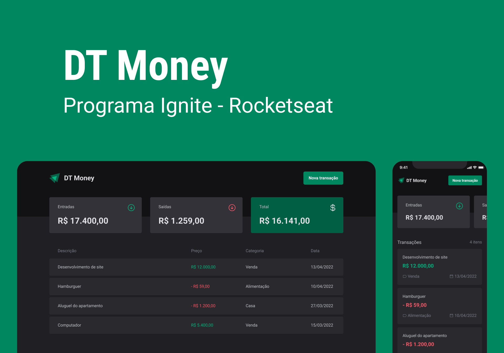

<h1 align="center">

</h1>

## 💻 Projeto

O dtmoney é uma aplicação de controle financeiro que foi desenvolvida durante as aulas do Módulo 3 da trilha de ReactJS do Bootcamp Ignite da Rocketseat. Com o dtmoney, os usuários podem cadastrar e excluir transações financeiras, além de visualizar informações sobre o saldo de entrada e saída de dinheiro. A aplicação utiliza tecnologias avançadas e recursos da comunidade para proporcionar uma experiência de gerenciamento financeiro mais eficaz. 💰

## 🚀 Tecnologias, Hooks e Bibliotecas

Projeto desenvolvido com as seguintes tecnologias:

- ReactJS
- TypeScript
- useState
- useEffect
- Context API
- Styled Components
- Axios
- Mirage JS
- Polished
- React Modal

## 🔖 Layout

Você pode visualizar o layout do projeto através [desse link](<https://www.figma.com/file/0xmu9mj2TJYoIOubBFWsk5/dtmoney-Ignite-(Copy)?node-id=0%3A1>). É necessário ter conta no [Figma](https://figma.com) para acessá-lo.

<strong>Por Carlos Henrique💜</strong>
